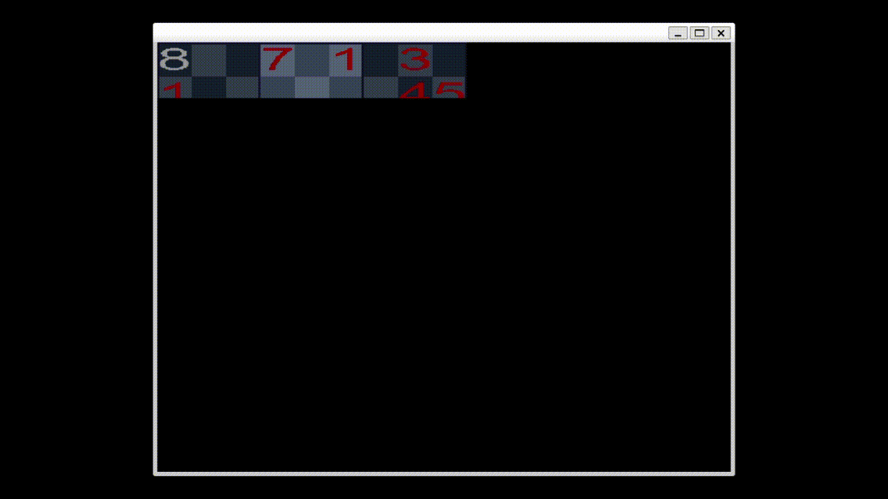

# Sudoku solver
Complète un sudoku automatiquement. Affichage fait avec SDL2. <br>

#### Informations
La grille du sudoku est un tableau à 2 dimensions.
- 0 : cases vides
- [1;9] : valeurs placées par le joueur
- [-9;-1] : valeurs fixes de la grilles, qui ne peuvent pas être modifiées
<br>
Pour modifier la grille du sudoku à calculer, aller dans le fichier `sudoku_solver.cpp` et modifier la variable `int tab[]` selon le même principe.

### Fonctionnement
Algorithme de backtracking, on place les valeurs dans les cases en partant de la case (0,0) jusqu'à (9,9). À chaque case on incrémente la valeur de la case, si on passe `9` c'est qu'il n'y a pas de solution donc, on la remet à `0` on retourne à la dernière case accessible par un joueur *(donc pas de valeur <0)* et on poursuit l'algo en incrémentant.

-------------------------
#### Compilation
```sh
make
```

#### Execution
```sh
./main
```
------------------------

